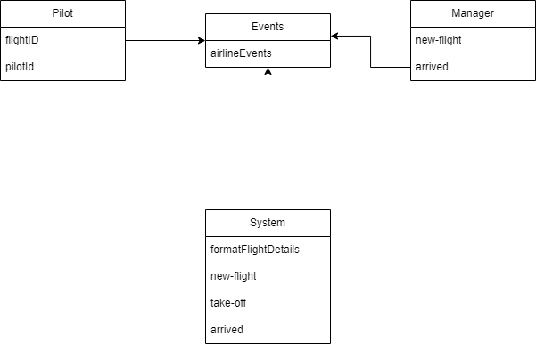
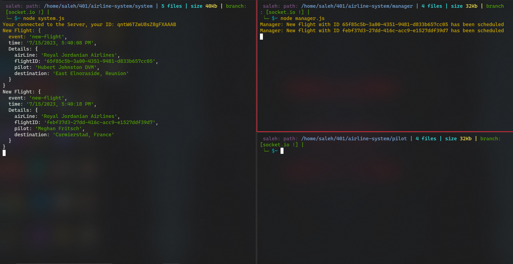
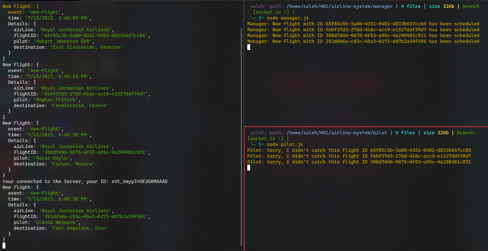

# Airline System


### UML :


#### [PR](https://github.com/saleh2001k/airline-system/pull/2)
### Output:

```bash
Manager: new flight with ID '6syze4b5t1' has been scheduled
Flight {
  event: 'new-flight',
  time: 07/10/2023, 03:18:41 PM,
  Details: {
    airLine: 'Royal Jordanian Airlines',
    flightID: '6syze4b5t1',
    pilot: 'lalo salmnca',
    destination: 'New York, USA'
  }
}
Pilot: flight with ID '6syze4b5t1' took-off
Flight {
  event: 'took-off',
  time: 07/10/2023, 03:18:45 PM,
  Details: {
    airLine: 'Royal Jordanian Airlines',
    flightID: '6syze4b5t1',
    pilot: 'lalo salmnca',
    destination: 'undefined'
  }
}
Pilot: flight with ID '6syze4b5t1' has arrived
Flight {
  event: 'arrived',
  time: 07/10/2023, 03:18:48 PM,
  Details: {
    airLine: 'Royal Jordanian Airlines',
    flightID: '6syze4b5t1',
    pilot: 'lalo salmnca',
    destination: 'undefined'
  }
}
Manager: we're greatly thankful for the amazing flight, lalo salmnca


```

----------
## Airline System (Socket.io)

#### [PR (Socket.io)](https://github.com/saleh2001k/airline-system/pull/4)
### Output:

#### system.js:

```bash
Your connected to the Server, you id: cUGXe-dKFRUeEh00AAAB
Your connected to the Server, you id: 09er3e1UP5Ll-CeXAAAE
New Flight: {
  event: 'new-flight',
  time: '7/12/2023, 5:47:07 PM',
  Details: {
    airLine: 'Royal Jordanian Airlines',
    flightID: '15f6e309-7598-4281-b7e2-3b94f1461d06',
    pilot: 'Jan Bayer',
    destination: 'South Rashawnbury, India'
  }
}
Took Off Flight: {
  event: 'took-off',
  time: '7/12/2023, 5:47:11 PM',
  Details: {
    airLine: 'Royal Jordanian Airlines',
    flightID: '15f6e309-7598-4281-b7e2-3b94f1461d06',
    pilot: 'Jan Bayer',
    destination: 'South Rashawnbury, India'
  }
}
Arrived Flight: {
  event: 'arrived',
  time: '7/12/2023, 5:47:14 PM',
  Details: {
    airLine: 'Royal Jordanian Airlines',
    flightID: '15f6e309-7598-4281-b7e2-3b94f1461d06',
    pilot: 'Jan Bayer',
    destination: 'South Rashawnbury, India'
  }
}

```
#### manager.js:
```bash
Manager: New flight with ID 15f6e309-7598-4281-b7e2-3b94f1461d06 has been scheduled
Manager: We're greatly thankful for the amazing flight Jan Bayer
Manager: New flight with ID 77fdd1b9-ab90-415a-b1a0-f962405f4d0b has been scheduled
Manager: We're greatly thankful for the amazing flight Edward Powlowski
Manager: New flight with ID ece223e9-18cf-4274-8e60-9c1c59f99796 has been scheduled
Manager: We're greatly thankful for the amazing flight Leslie Jacobi I
Manager: New flight with ID 475f6461-b874-43e7-b732-8345dd1f5001 has been scheduled
Manager: We're greatly thankful for the amazing flight Danny Hirthe
Manager: New flight with ID e74781ac-a2a8-4457-9217-0a54ea111001 has been scheduled
Manager: We're greatly thankful for the amazing flight Tracy Ryan

```

#### pilot.js

```
Pilot: Flight with ID 15f6e309-7598-4281-b7e2-3b94f1461d06 took off
Pilot: Flight with ID 15f6e309-7598-4281-b7e2-3b94f1461d06 has arrived
Pilot: Flight with ID 77fdd1b9-ab90-415a-b1a0-f962405f4d0b took off
Pilot: Flight with ID 77fdd1b9-ab90-415a-b1a0-f962405f4d0b has arrived
Pilot: Flight with ID ece223e9-18cf-4274-8e60-9c1c59f99796 took off
Pilot: Flight with ID ece223e9-18cf-4274-8e60-9c1c59f99796 has arrived
Pilot: Flight with ID 475f6461-b874-43e7-b732-8345dd1f5001 took off
Pilot: Flight with ID 475f6461-b874-43e7-b732-8345dd1f5001 has arrived
Pilot: Flight with ID e74781ac-a2a8-4457-9217-0a54ea111001 took off
Pilot: Flight with ID e74781ac-a2a8-4457-9217-0a54ea111001 has arrived

```


----------
## Airline System (Socket.io) 2

#### [PR (Socket.io) 2](https://github.com/saleh2001k/airline-system/pull/5)

To test this lab you need to start the system.js and the manager.js for as much as you want, then when you start the pilot.js, you will see all the missed flights in the pilot log:


##### before running the pilot:
#### system.js:

```bash
Your connected to the Server, your ID: qntW6TZwU8sZ8gFXAAAB
New Flight: {
  event: 'new-flight',
  time: '7/15/2023, 5:40:08 PM',
  Details: {
    airLine: 'Royal Jordanian Airlines',
    flightID: '65f85c5b-3a00-4351-9481-d833b657cc05',
    pilot: 'Hubert Johnston DVM',
    destination: 'East Elnoraside, Reunion'
  }
}
New Flight: {
  event: 'new-flight',
  time: '7/15/2023, 5:40:18 PM',
  Details: {
    airLine: 'Royal Jordanian Airlines',
    flightID: 'febf37d3-27dd-416c-acc9-e1527ddf39d7',
    pilot: 'Meghan Fritsch',
    destination: 'Cormierstad, France'
  }
}
New Flight: {
  event: 'new-flight',
  time: '7/15/2023, 5:40:28 PM',
  Details: {
    airLine: 'Royal Jordanian Airlines',
    flightID: '308d7d46-9675-4f53-a95c-4a298481c931',
    pilot: 'Marie Doyle',
    destination: 'Carson, Monaco'
  }
}

```
#### manager.js:
```bash
Manager: New flight with ID 65f85c5b-3a00-4351-9481-d833b657cc05 has been scheduled
Manager: New flight with ID febf37d3-27dd-416c-acc9-e1527ddf39d7 has been scheduled
Manager: New flight with ID 308d7d46-9675-4f53-a95c-4a298481c931 has been scheduled

```

##### and when werun the pilot, you will get the missed filght  
#### pilot.js

```
Pilot: Sorry, I didn't catch this flight ID 65f85c5b-3a00-4351-9481-d833b657cc05
Pilot: Sorry, I didn't catch this flight ID febf37d3-27dd-416c-acc9-e1527ddf39d7
Pilot: Sorry, I didn't catch this flight ID 308d7d46-9675-4f53-a95c-4a298481c931
```

Before:

After:
